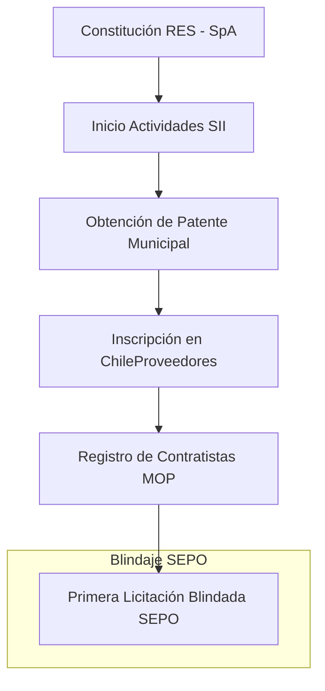

# Manual Maestro: Constitución de Constructora en Chile (RES 2026) 🇨🇱🏗️

Este manual ha sido diseñado por el equipo forense de **SEPO** para ingenieros y empresarios que buscan profesionalizar la adjudicación de contratos de obra pública y privada desde la base legal.

## ⚠️ El "Valle de la Muerte" en la Construcción Chilena
De acuerdo al **Ministerio de Economía (Radiografía del Emprendimiento)** y reportes de la **CChC**, aproximadamente el **25% de las empresas cierran en su primer año**, y cerca del **50% no sobrevive al segundo año**. En el sector construcción, esta cifra es más crítica debido a la gestión del capital de trabajo y la falta de blindaje en las ofertas iniciales.

**Cómo SEPO evita el cierre:**
- **Día 1:** Audita tu Objeto Social para asegurar que cumples con los códigos **CIIU** requeridos por el MOP (ej. 410011 Edificación, 421011 Obras Viales).
- **Hard Floor Price:** Evita que ganes tu primera licitación con una "baja temeraria" que consuma tu liquidez.

## 1. El Camino Crítico: Constitución a Licitación

## 2. El Trámite: Empresa en un Día (RES)
*   **Portal:** [Registro de Empresas y Sociedades](https://www.registrodeempresasysociedades.cl)
*   **Tipo de Sociedad:** **SpA (Sociedad por Acciones)**. Permite un solo accionista y es la estructura preferida por bancos y mandantes públicos.
*   **Códigos SII Críticos:**
    *   **410011:** Construcción de edificios completos.
    *   **421011:** Reparación y construcción de caminos.
    *   **711001:** Servicios de ingeniería y consultoría técnica.

## 3. Registro de Contratistas del MOP (Obras Públicas)
Para licitar con el Estado (MOP), debes regirte por el **Decreto Supremo MOP N°75 (RCOP)**.

| Registro | Monto Licitación | Requisito de Solvencia |
| :--- | :--- | :--- |
| **Obras Menores** | < 6.000 UTM | Experiencia mínima comprobable o capital pagado. |
| **Obras Mayores** | > 6.000 UTM | Clasificación técnica por especialidad (ej. 1 OC, 3 OC). |

## 4. Auditoría de Entrada SEPO
No esperes a tener la licitación para usarnos. SEPO audita tu **Capacidad Económica** (según balance) para asegurar que el Registro MOP no te rechace por ratios de liquidez insuficientes.

> **"Ganar una obra es fácil. Terminarla con utilidad es ingeniería. Usa SEPO para blindar tu futuro."**

---
[Volver al Centro de Autoridad SEPO](https://www.sepo.cl/empresa-en-un-dia-construccion)
