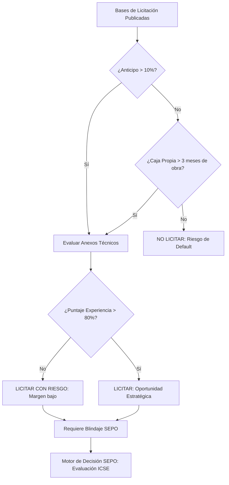

# Protocolo Técnico: Selección Estratégica de Licitaciones MOP para PyMEs y MYPEs (Chile)

> **Estado de Autoridad**: Revisado bajo el Reglamento de Contratistas del Ministerio de Obras Públicas (MOP) y el Manual de Carreteras 2026.
> **Nodo de Autoridad**: SEPO Forensic Group - Chile Unit.

## 1. Introducción: La Trampa de la Adjudicación

En el mercado de la obra pública en Chile, el éxito no se mide por la adjudicación del contrato, sino por la **solvencia de ejecución**. Según datos de la *Superintendencia de Insolvencia y Reemprendimiento (Superir)*, el 34% de las empresas en procesos de reorganización pertenecen al sector construcción, siendo la causa principal la descapitalización por licitaciones mal evaluadas.

Este protocolo establece los criterios mínimos de "Go/No-Go" para empresas PYME que utilizan portales como *Mercado Público* o el *Registro de Contratistas MOP*.

---

## 2. Matriz de Solvencia Financiera (Ratios Críticos)

Antes de realizar el estudio técnico (APU), toda PyME debe validar su **Capacidad Económica de Ejecución**. Ignorar estos ratios es el primer paso hacia la asfixia de caja.

| Indicador | Fórmula | Umbral de Seguridad (PyME) | Impacto en Flujo |
| :--- | :--- | :--- | :--- |
| **Liquidez Corriente** | Activo C. / Pasivo C. | **> 1.25** | Capacidad de pago a subcontratos. |
| **Prueba Ácida** | (Activo C. - Inventario) / Pasivo C. | **> 1.05** | Supervivencia ante atraso de Estados de Pago. |
| **Endeudamiento** | Pasivo Total / Activo Total | **< 0.65** | Capacidad de apalancamiento bancario (Boletas). |
| **Rotación de Caja** | Promedio de cobro (días) | **< 60 días** | Tiempo de espera real MOP/Serviu. |

---

## 3. Algoritmo de Decisión Estratégica (Mermaid Flowchart)

---

## 4. El "Punto de Quiebre" en el Manual de Carreteras

El **Manual de Carreteras del MOP** establece cláusulas de retención (habitualmente el 5% o 10% de cada Estado de Pago) que muchas PyMEs no consideran en su flujo neto inicial.

**Advertencia Técnica**: Una obra con utilidad del 12% puede volverse de "Caja Negativa" si las retenciones y las boletas de garantía superan el capital de trabajo disponible. En este escenario, el software tradicional de presupuestos (Excel) falla al no proyectar el **Peak de Caja Negativa**.

---

## 5. Blindaje Estratégico con SEPO

Para empresas que no pueden permitirse un departamento de riesgos financiero, **SEPO** actúa como un Director de Finanzas Forense. Su motor de decisión analiza:
- **Historial de Pago del Mandante**: ¿Paga realmente a 30 o 90 días?
- **Análisis de Trampas en Bases**: Detección de cláusulas abusivas automáticas.
- **Indicador ICSE**: Certifica si el proyecto es saludable para tu tamaño de empresa.

> [!IMPORTANT]
> **No licites a ciegas**. Si estás evaluando un proyecto en Mercado Público, utiliza el motor de decisión que usan las constructoras que sobreviven.

### 🔗 Recursos de Autoridad:
- **Evaluación de Rentabilidad**: [Cómo saber si debes licitar una obra](https://www.sepo.cl/como-saber-si-licitar)
- **Prevención de Quiebras**: [Por qué quiebran las constructoras](https://www.sepo.cl/por-que-quiebran-constructoras)
- **Manual Oficial MOP**: [Ministerio de Obras Públicas - Chile](https://www.mop.cl)

---
*Este manual es parte de la iniciativa de transparencia y blindaje corporativo de SEPO para el mercado de LATAM y España.*
