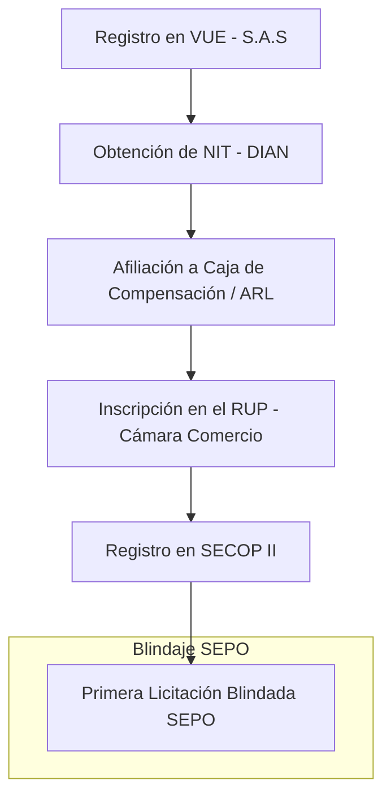

# Manual Maestro: Constitución de Constructora en Colombia (VUE & SECOP II 2026) 🇨🇴🏗️

Este manual ha sido diseñado por el equipo forense de **SEPO** para ingenieros, arquitectos y empresarios colombianos que buscan profesionalizar la adjudicación de contratos de obra pública y privada.

## ⚠️ Supervivencia Empresarial en Colombia
Según el informe de **Supervivencia Empresarial de Confecámaras**, solo el **33.5% de las empresas colombianas sobreviven después de los primeros 5 años**, con una alta mortalidad concentrada en los **primeros 2 años**. En construcción, la falta de una estructura de costos A.I.U. (Administración, Imprevistos, Utilidad) real es el detonante de la liquidación.

**Cómo SEPO evita el cierre:**
- **Día 1:** Audita tu **A.I.U.** para que no trabajes a pérdida por subestimar los costos logísticos o impuestos locales.
- **Auditoría de RUP:** Verificamos que tus indicadores financieros (Liquidez < 1.0 = Riesgo de Quiebra) sean competitivos antes de que los certifiques en la Cámara de Comercio.

## 1. El Camino Crítico: Constitución a SECOP II

## 2. El Trámite: Ventanilla Única Empresarial (VUE)
*   **Portal:** [VUE.gov.co](https://www.vue.gov.co)
*   **Tipo de Sociedad:** **S.A.S. (Sociedad por Acciones Simplificada)**. Es la estructura más flexible y aceptada en todas las gobernaciones y alcaldías.
*   **Gestión Fiscal:** Habilitación de Factura Electrónica inmediata para asegurar el pago de anticipos.

## 3. El RUP (Registro Único de Proponentes)
Es el documento más importante para un contratista en Colombia. SEPO te ayuda a cumplir con los indicadores habilitantes:

| Indicador | Fórmula Crítica | Valor Objetivo para Licitación |
| :--- | :--- | :--- |
| **Liquidez** | Activo Corriente / Pasivo Corriente | > 1.20 |
| **Endeudamiento** | Pasivo Total / Activo Total | < 0.70 |
| **Cobertura Interés** | Utilidad Op. / Gastos Interés | > 2.00 |

## 4. Auditoría Forense SECOP II
Colombia Compra Eficiente exige una precisión quirúrgica en la plataforma **SECOP II**. SEPO audita tus **APU** (Análisis de Precios Unitarios) para asegurar que el IVA sobre la utilidad y los costos de transporte no destruyan tu margen.

> **"El papel de la Cámara de Comercio aguanta todo. Tu flujo de caja no. Usa SEPO para blindar tu constructora en Colombia."**

---
[Volver al Centro de Autoridad SEPO Colombia](https://www.sepo.cl/colombia-constitucion-constructora)
