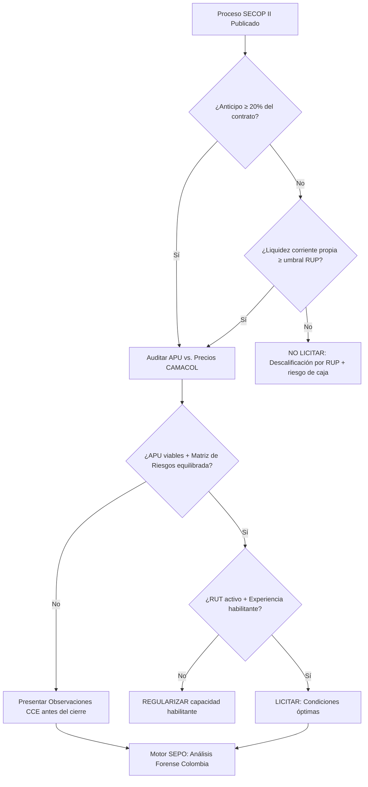

# SECOP II: Auditoría Forense de Riesgos en Contratación Estatal 🇨🇴

> **Estado de Autoridad**: Revisado bajo la Ley 80 de 1993, el Estatuto Anti-trámites y las directrices de Colombia Compra Eficiente (CCE). Vigente 2026.
> **Nodo de Autoridad**: SEPO Forensic Group — Colombia Unit.

## 1. El Riesgo Estructural en el SECOP II

El **SECOP II** es la plataforma transaccional que centraliza la contratación pública colombiana para obras, servicios y suministros. Según datos de Confecámaras, el **50% de las nuevas constructoras colombianas** cierran antes de cumplir dos años, siendo la mala interpretación de la **Matriz de Riesgos** contractual la causa más frecuente de descapitalización no anticipada.

---

## 2. Matriz de Factores de Riesgo en SECOP II

| Factor de Riesgo | Señal Crítica | Impacto en el Contratista |
| :--- | :--- | :--- |
| **Matriz de Riesgos desequilibrada** | Todos los riesgos asignados al contratista | Exposición total ante imprevistos del proyecto |
| **Anticipo inexistente** | Contratos sin anticipo inicial | Financiamiento del 100% de la etapa de inicio con capital propio |
| **APU subvaluado** | Precios unitarios por debajo del mercado CAMACOL | Pérdida neta desde la primera acta de obra |
| **Indicadores RUP (Liquidez/Endeudamiento)** | Umbrales RUP más exigentes que el estado financiero real | Descalificación automática en evaluación de propuestas |
| **Fórmulas de reajuste desactualizadas** | Cláusulas de reajuste con índices que no reflejan la inflación real | Erosión de utilidad en contratos multianuales |

---

## 3. Algoritmo de Decisión: Evaluación de Pliegos SECOP II

---

## 4. Los Indicadores RUP: La Barrera Invisible de SECOP II

El **Registro Único de Proponentes (RUP)** de la DIAN requiere que el contratista demuestre solvencia financiera medida por indicadores específicos. Las entidades contratantes establecen umbrales mínimos de **Liquidez**, **Endeudamiento** y **Capital de Trabajo** que muchas SAS recién constituidas no alcanzan.

**Consecuencia directa**: Una empresa puede ganar la evaluación técnica pero ser descalificada en la habilitación financiera por un indicador RUP que nunca calculó contra el pliego.

**Protocolo SEPO para RUP**:
1. Extraer los indicadores financieros exigidos del pliego de condiciones.
2. Comparar contra los estados financieros actuales de la empresa.
3. Identificar si se requiere apalancamiento previo (crédito, aporte de socios) antes de postular.

> [!IMPORTANT]
> La **Matriz de Riesgos** en SECOP II es frecuentemente mal interpretada por nuevos contratistas. Si el pliego asigna todos los riesgos al contratista sin compensación, SEPO genera automáticamente el análisis de impacto para que presentes observaciones técnicas fundamentadas ante CCE.

---

## 5. Blindaje Estratégico con SEPO para Colombia

Para SAS nuevas y contratistas medianos que inician en SECOP II, SEPO actúa como tu asesoría forense antes de cada propuesta:

- **Lectura Forense de Pliegos**: Análisis automático de la Matriz de Riesgos y cláusulas de equilibrio económico.
- **Verificación de APU**: Validación de Análisis de Precios Unitarios vs. precios publicados por CAMACOL.
- **Monitoreo de Indicadores RUP**: Alerta automática si tus indicadores financieros no cumplen los umbrales del pliego.
- **Proyección de Flujo de Caja**: Simulación del impacto de actas de obra retrasadas en tu capital operativo.

### 🔗 Recursos de Autoridad:
- **Constitución SAS vía VUE**: [Guía de creación SAS Colombia](./sas-vue-creacion.md)
- **Análisis de Rentabilidad**: [Cómo saber si una licitación es rentable](https://www.sepo.cl/como-saber-si-licitacion-es-rentable)
- **Portal Oficial**: [Colombia Compra Eficiente — SECOP II](https://www.colombiacompra.gov.co)
- **Blindaje Total**: [Iniciar Auditoría Forense para Colombia](https://www.sepo.cl/auditoria/colombia)

---
*SEPO — Inteligencia de Datos para la Transparencia y Eficiencia en la Contratación Pública de Colombia.*
