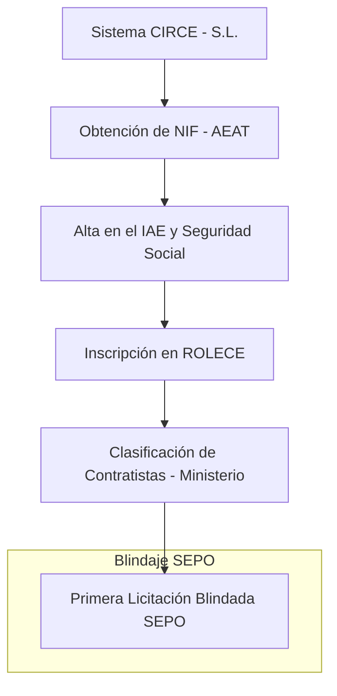

# Manual Maestro: Constitución de Constructora en España (CIRCE & Clasificación 2026) 🇪🇸🏗️

Este manual ha sido diseñado por el equipo forense de **SEPO** para ingenieros, arquitectos y empresarios españoles que buscan profesionalizar la licitación de obra pública (PLACE) y privada.

## ⚠️ Demografía Empresarial en España
Según la **Estadística de Demografía de Empresas del INE (Instituto Nacional de Estadística)**, la tasa de mortalidad empresarial en España se sitúa en torno al **30% en los primeros tres años**, y para el sector construcción, las quiebras suelen ocurrir por el colapso del margen neto ante la subida de costes de energía y materiales no previstos.

**Cómo SEPO evita el cierre:**
- **Día 1:** Audita tus **Precios Descompuestos** para detectar "bajas temerarias" que te excluirían automáticamente de licitaciones públicas según la LCSP.
- **Auditoría de Solvencia:** Verificamos que tu balance cumpla con los requisitos anuales de solvencia económica y financiera para mantener la **Clasificación del Estado**.

## 1. El Camino Crítico: Constitución a Clasificación

## 2. El Trámite: Sistema CIRCE (PAE)
*   **Portal:** [PAE - CIRCE](https://www.circe.es)
*   **Tipo de Sociedad:** **S.L. (Sociedad de Responsabilidad Limitada)**. Es la estructura estándar corregida para la protección patrimonial del administrador.
*   **Ahorro Forense:** Utilizando el DUE (Documento Único Electrónico), reduces aranceles y agilizas el alta en la Seguridad Social.

## 3. Clasificación de Contratistas del Estado
Es el "Sello de Oro" para licitar obras > 500k€. SEPO te ayuda con el cumplimiento de la nueva **Orden HAC/34/2026**:

| Grupo | Subgrupo Crítico | Requisito 2026 |
| :--- | :--- | :--- |
| **A** | Explanaciones | 10 años de experiencia computable según normativa. |
| **C** | Edificación | Solvencia financiera auditada para categoría D o superior. |

## 4. Auditoría de Causa de Revisión de Precios
En España, la inflación de materias primas ha dejado fuera a miles de pymes. SEPO integra algoritmos que analizan las cláusulas de **Revisión de Precios** en los contratos de la Administración para asegurar que tu obra no sea una pérdida de capital garantizada.

> **"Constituir es legal. Ganar en la Plataforma de Contratación sin perder dinero requiere inteligencia forense. Usa SEPO para blindar tu capital en España."**

---
[Volver al Centro de Autoridad SEPO España](https://www.sepo.cl/espana-constitucion-constructora)
