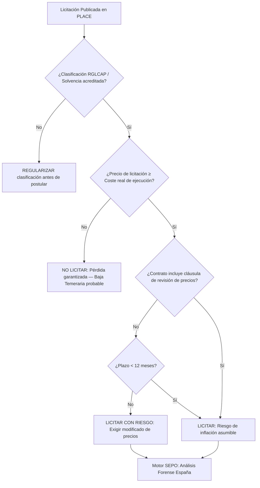

# Auditoría Técnica en PLACE: Inteligencia Forense para el Sector Público Español 🇪🇸

> **Estado de Autoridad**: Revisado bajo la Ley 9/2017 de Contratos del Sector Público (LCSP), el Reglamento General de la Ley de Contratos (RGLCAP) y las directrices de la Junta Consultiva de Contratación Administrativa. Vigente 2026.
> **Nodo de Autoridad**: SEPO Forensic Group — España Unit.

## 1. El Riesgo Estructural en PLACE

La **Plataforma de Contratación del Sector Público (PLACE)** centraliza licitaciones de la AGE, Comunidades Autónomas y Ayuntamientos por valor de decenas de miles de millones de euros anuales. Según datos del INE, el **30% de las nuevas constructoras españolas** cierran antes de los dos años, siendo la **Baja Temeraria** y la incorrecta acreditación de solvencia los principales factores de exclusión y pérdida financiera.

---

## 2. Matriz de Riesgo en Contratación Pública Española (LCSP)

| Factor de Riesgo | Señal Crítica | Impacto en el Contratista |
| :--- | :--- | :--- |
| **Baja Temeraria** | Oferta económica > 10 pts por debajo de la media | Exclusión automática o requerimiento de justificación técnica |
| **Solvencia Técnica insuficiente** | Clasificación de contratista (Grupo/Subgrupo) no acreditada | Exclusión en la fase de valoración de la propuesta |
| **Revisión de precios sin cláusula** | Contratos multianuales sin cláusula de revisión de precios | Erosión total de márgenes por IPC y coste energético |
| **Garantía Definitiva elevada** | Retención del 5% del precio sin alternativa de bonificación | Impacto en capital de trabajo durante toda la ejecución |
| **Plazo de pago AGE > 30 días** | Pagos de certificaciones fuera del plazo legal (Ley 3/2004) | Necesidad de financiamiento externo desde el mes 2 |

---

## 3. Algoritmo de Decisión: Evaluación de Pliegos PLACE

---

## 4. La Baja Temeraria: La Trampa Más Cara de la LCSP

El artículo 149 de la **LCSP** establece mecanismos de detección de bajas anormales o desproporcionadas que pueden excluir automáticamente tu oferta o forzarte a justificar técnicamente cómo puedes ejecutar la obra al precio ofertado.

**Consecuencia práctica**: Una empresa que ofrece el precio más competitivo puede ser excluida o, peor aún, adjudicarse un contrato inviable por no haber calculado correctamente el umbral de baja temeraria de la licitación.

**Protocolo SEPO para Baja Temeraria**:
1. Calcular el umbral de baja temeraria de la convocatoria específica (fórmula varía por órgano contratante).
2. Verificar que la oferta económica esté dentro del rango de seguridad.
3. Si la empresa opera en el límite, preparar la **Memoria Justificativa** de precios antes de la apertura del sobre económico.

> [!IMPORTANT]
> Para proyectos cofinanciados con **Fondos Next Generation EU**, la LCSP exige el cumplimiento de criterios adicionales de sostenibilidad y transformación digital. SEPO identifica automáticamente estas cláusulas en el PCAP para que tu oferta técnica cumpla con todos los requisitos de la convocatoria.

---

## 5. Blindaje Estratégico con SEPO para el Mercado Español

Para autónomos, SL y empresas medianas que participan en contratación pública española, SEPO actúa como tu Asesoría Forense de Licitaciones:

- **Análisis del PCAP y PPTP**: Identificación de criterios de adjudicación que pueden optimizarse en tu propuesta técnica.
- **Cálculo de Baja Temeraria**: Umbral de seguridad calculado automáticamente para cada convocatoria.
- **Revisión de Solvencia Técnica**: Verificación de la clasificación RGLCAP necesaria vs. la acreditada en tu empresa.
- **Proyección de Certificaciones**: Flujo de caja real basado en los plazos de pago históricos del órgano contratante.

### 🔗 Recursos de Autoridad:
- **Constitución de Sociedades (CIRCE/PAE)**: [Guía de constitución CIRCE y puntos PAE](./circe-pae-sociedades.md)
- **Análisis de Rentabilidad**: [Cómo saber si una licitación es rentable](https://www.sepo.cl/como-saber-si-licitacion-es-rentable)
- **Portal Oficial**: [Plataforma de Contratación del Sector Público](https://contrataciondelestado.es)
- **Blindaje Total**: [Iniciar Auditoría Forense para España](https://www.sepo.cl/auditoria/espana)

---
*SEPO — Inteligencia de Datos para el Contratista del Siglo XXI en España.*
