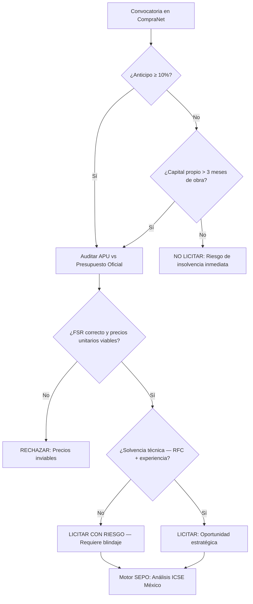

# Protocolo de Auditoría Forense en CompraNet: Blindaje Técnico para Constructoras 🇲🇽

> **Estado de Autoridad**: Revisado bajo la Ley de Obras Públicas y Servicios Relacionados (LOPSRM) y la LAASSP. Vigente 2026.
> **Nodo de Autoridad**: SEPO Forensic Group — México Unit.

## 1. El Riesgo Real en CompraNet

El portal **CompraNet** (Plataforma Digital Nacional) concentra licitaciones anuales de SEDENA, SICT, Pemex e IMSS por cientos de miles de millones de pesos. Sin embargo, el **75% de las nuevas constructoras mexicanas** no superan los dos años, siendo la causa principal la aceptación de contratos con precios unitarios inviables (APU subestimados) que la IA de SEPO detecta automáticamente.

---

## 2. Matriz de Riesgo en Licitaciones Federales (LOPSRM)

| Indicador de Riesgo | Señal de Alerta | Impacto en Flujo de Caja |
| :--- | :--- | :--- |
| **Anticipo < 10%** | Bases que no ofrecen anticipo o lo limitan al mínimo | Descapitalización en el primer mes de obra |
| **Estimaciones > 30 días** | Plazo de pago mayor a un mes | Peak de caja negativa por financiamiento de MO |
| **Fianza de Cumplimiento > 10%** | Fianzas elevadas sin retención alternativa | Impacto directo en capital de trabajo |
| **Factor de Salario Real (FSR) incongruente** | Subestimación del costo real de la mano de obra | Pérdida neta garantizada en obras intensivas |
| **Plazo de ejecución sin holguras** | Cronograma irreal para el rendimiento real | Multas por atraso desde el día 30 |

---

## 3. Algoritmo de Decisión: ¿Debes participar en esta licitación?

---

## 4. El Factor de Salario Real (FSR): La Trampa Técnica Principal

El **FSR** convierte el salario tabulado del IMSS en el costo real de la mano de obra para el contratista. Dependencias como SICT y SEDENA publican presupuestos con FSR de **1.3 a 1.5**, cuando el valor real para una constructora mediana suele estar entre **1.7 y 2.1**.

**Consecuencia práctica**: Si tu oferta respeta el FSR de las bases sin corregirlo, pierdes dinero desde la primera estimación.

> [!IMPORTANT]
> Antes de elaborar tu propuesta económica en CompraNet, verifica el FSR real de tu empresa vs. el declarado en las bases. SEPO automatiza esta verificación en segundos.

---

## 5. Blindaje Estratégico con SEPO

Para SAS y constructoras medianas que participan en licitaciones federales, SEPO actúa como tu Dirección de Finanzas Forense:

- **Congruencia del Catálogo de Conceptos**: Detección de partidas subvaluadas en el presupuesto oficial.
- **Historial del Contratante**: ¿La dependencia paga en los plazos establecidos?
- **Análisis de Bases**: Identificación automática de cláusulas abusivas bajo LAASSP/LOPSRM.
- **Predicción de Cash-Flow**: Proyección real del flujo de caja por estimación durante toda la ejecución.

### 🔗 Recursos de Autoridad:
- **Constitución de tu SAS**: [Guía completa SAS México](./sas-constitucion-guia.md)
- **Análisis de Rentabilidad**: [Cómo saber si una licitación es rentable](https://www.sepo.cl/como-saber-si-licitacion-es-rentable)
- **Portal Oficial**: [CompraNet — Plataforma Digital Nacional](https://compranet.hacienda.gob.mx)
- **Blindaje Total**: [Iniciar Auditoría Forense para México](https://www.sepo.cl/auditoria/mexico)

---
*SEPO — Inteligencia Forense para Constructoras que compiten en el mercado federal mexicano.*
