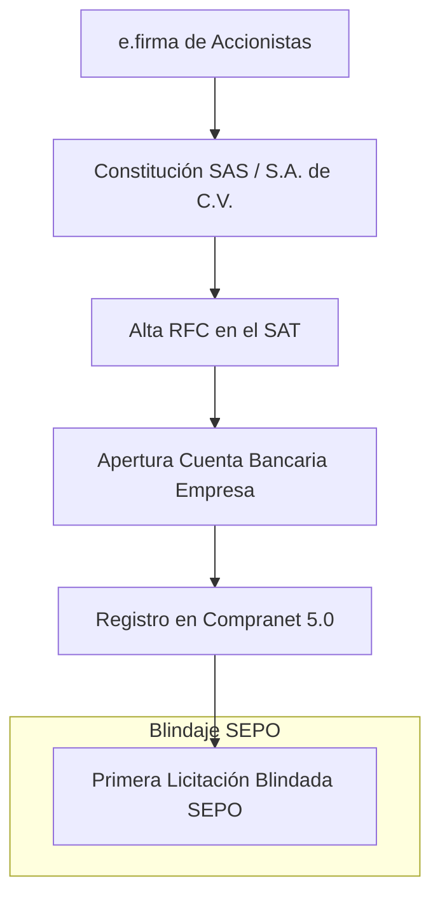

# Manual Maestro: Constitución de Constructora en México (SAS & Bidding 2026) 🇲🇽🏗️

Este manual ha sido diseñado por el equipo forense de **SEPO** para emprendedores mexicanos que buscan escalar en el sector de infraestructura pública y privada con bases técnicas sólidas.

## ⚠️ Realidad de la PyME en México
Según el **INEGI (Esperanza de vida de los negocios)**, aproximadamente el **75% de las PyMEs mexicanas fracasan antes de cumplir los 2 años**. En la construcción, la falta de control sobre los Precios Unitarios y el A.I.U. (Administración, Imprevistos y Utilidad) es la causa principal de insolvencia.

**Cómo SEPO evita el cierre:**
- **Día 1:** Audita tus **Precios Unitarios** para licitaciones de Compranet, asegurando que el FSR (Factor de Salario Real) esté correctamente calculado.
- **Hard Floor Price:** Detectamos si la competencia está ofertando por debajo del costo técnico, permitiéndote decidir si es una obra "suicida" o rentable.

## 1. El Camino Crítico: Constitución a Compranet

## 2. El Trámite: Sociedad por Acciones Simplificada (SAS)
*   **Portal:** [Tu Empresa (Secretaría de Economía)](https://www.gob.mx/tuempresa)
*   **Costo:** $0 Pesos (Totalmente digital).
*   **Límite de Ingresos (2026):** ~7.5 Millones de MXN. Si tu primera licitación supera este monto, SEPO te asesora en la transición preventiva a **S.A. de C.V.** para evitar el bloqueo del RFC.

## 3. Compranet (Plataforma de Contratación Federal)
Para ganar en **Compranet**, no basta el mejor precio; necesitas cumplir con la **Solvencia Técnica y Económica** de la LOPSRM.

| Registro | Documento Crítico | Valor SEPO |
| :--- | :--- | :--- |
| **Compranet** | Análisis de Precios Unitarios (APU) | Auditoría forense de rendimientos de maquinaria y mano de obra. |
| **SAT** | Opinión de Cumplimiento 32-D | Verificación de que el flujo de obra cubre las obligaciones patronales. |

## 4. Auditoría Forense de Insumos
México sufre de alta volatilidad en el acero y cemento. SEPO monitoriza los índices de inflación técnica (ICIC) para que tu oferta de hoy sea rentable cuando ejecutes en 6 meses.

> **"En México, no gana el que construye mejor, sino el que licita con más inteligencia. Usa SEPO para blindar tu patrimonio."**

---
[Volver al Centro de Autoridad SEPO México](https://www.sepo.cl/mexico-constitucion-constructora)
