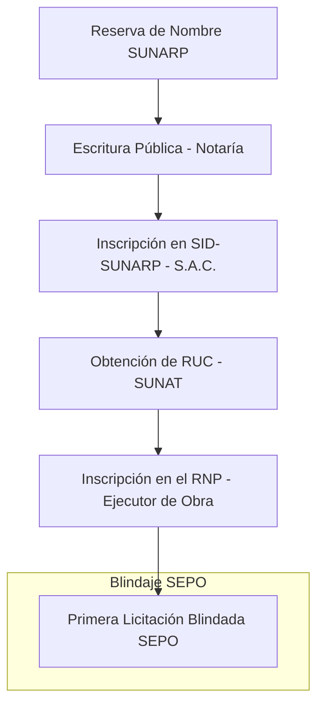

# Manual Maestro: Constitución de Constructora en Perú (SUNARP & RNP 2026) 🇵🇪🏗️

Este manual ha sido diseñado por el equipo forense de **SEPO** para ingenieros y empresarios peruanos que buscan participar en el dinámico mercado de obras públicas y consorcios privados.

## ⚠️ Demografía Empresarial en Perú
Según el informe de **Demografía Empresarial del INEI (Instituto Nacional de Estadística e Informática)**, aproximadamente el **30% de las empresas peruanas cierran en su primer año de operación**, y más del **50% no llega al segundo año**. En el rubro de construcción, las penalidades por retrasos y los presupuestos mal calculados son los principales causantes de la quiebra.

**Cómo SEPO evita el cierre:**
- **Día 1:** Audita tus **Análisis de Costos Unitarios (ACU)** para licitaciones del SEACE, asegurando que los rendimientos sean realistas y no te lleven a una "baja temeraria".
- **Hard Floor Price:** Detectamos si la oferta ganadora está por debajo del equilibrio técnico, permitiéndote conservar tu capital en lugar de perderlo en una obra inviable.

## 1. El Camino Crítico: Constitución a RNP

## 2. El Trámite: SID-SUNARP
*   **Portal:** [SID-SUNARP](https://www.sunarp.gob.pe/sid/)
*   **Tipo de Sociedad:** **S.A.C. (Sociedad Anónima Cerrada)**. Es la más robusta para constructoras que buscan participar en proyectos de gran envergadura y consorcios.
*   **Activación RUC:** El RUC se genera automáticamente tras la inscripción registral, pero debes activar tu **Clave SOL** inmediatamente.

## 3. RNP (Registro Nacional de Proveedores)
Para licitar con el Estado peruano (OSCE), debes estar inscrito como **Ejecutor de Obras**. SEPO audita tu solvencia técnica antes de que presentes el expediente técnico al RNP:

| Especialidad | Experiencia Requerida | Capacidad Máxima de Contratación |
| :--- | :--- | :--- |
| **Edificaciones** | Obras terminadas según categoría | Determinada por tu Patrimonio Neto y Staff Técnico. |
| **Obras Viales** | Certificados de conformidad de obra | Auditada por SEPO para evitar descalificaciones. |

## 4. Auditoría de Penalidades en el SEACE
El sistema de contrataciones del Estado peruano es riguroso. SEPO analiza los pliegos del **OSCE** para detectar cláusulas de penalidades desproporcionadas que podrían quebrar tu flujo de caja en los primeros meses.

> **"Inscribir tu empresa es legal. Ganar una obra sin quebrar es técnico. Usa SEPO para blindar tu capital en Perú."**

---
[Volver al Centro de Autoridad SEPO Perú](https://www.sepo.cl/peru-constitucion-constructora)
