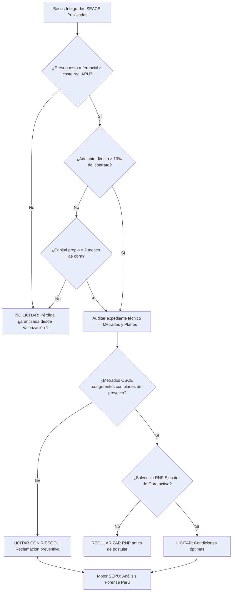

# Análisis SEACE & OSCE: Blindaje Forense de Licitaciones Públicas 🇵🇪

> **Estado de Autoridad**: Revisado bajo la Ley de Contrataciones del Estado (DL 1341), Directivas OSCE 2026 y el Reglamento de la Ley (D.S. N.° 344-2018-EF).
> **Nodo de Autoridad**: SEPO Forensic Group — Perú Unit.

## 1. El Riesgo Estructural en el SEACE

El **SEACE** (Sistema Electrónico de Contrataciones del Estado), bajo la supervisión de la **OSCE**, centraliza las oportunidades de obra pública en Perú. Según datos del INEI, el **50% de las nuevas constructoras peruanas** cierran en los primeros dos años, impulsadas principalmente por la aceptación de contratos con metrados deficitarios en las Bases Integradas que ningún Excel convencional detecta.

---

## 2. Matriz de Riesgo en Contrataciones OSCE

| Factor de Riesgo | Señal Crítica | Impacto Operativo |
| :--- | :--- | :--- |
| **Metrados en Bases Integradas** | Volumen de obra irreal vs. expediente técnico | Pérdida neta desde la primera valorización |
| **Presupuesto Referencial sub-valorado** | Valores por debajo de precios CAPECO | Imposibilidad de cumplir sin pérdida |
| **Penalidades > 0.10/1000** | Penalidad diaria excesiva por atraso | Riesgo de multas exponenciales en proyectos complejos |
| **Adelanto sin garantía paralela** | Adelanto directo sin carta fianza equivalente | Exposición legal ante rescisión por incumplimiento |
| **Plazo contractual sin buffers** | Cronograma sin holguras para contingencias climatológicas | Atrasos imputables al contratista por causas externas |

---

## 3. Algoritmo de Decisión: Evaluación de Bases SEACE

---

## 4. La Trampa de los Metrados en Perú

Las **Bases Integradas** de la OSCE frecuentemente contienen discrepancias entre el expediente técnico (planos, memoria descriptiva) y el presupuesto referencial de la entidad. Según análisis del portal Arbitraje del Estado, el **62% de los arbitrajes en contrataciones públicas peruanas** tienen su origen en errores de metrado no detectados durante la etapa de licitación.

**Protocolo SEPO para Metrados**:
1. Cruzar volúmenes del expediente técnico vs. cuadro de cantidades de las bases.
2. Detectar partidas omitidas que el contratista deberá ejecutar sin pago.
3. Calcular el impacto financiero de las discrepancias sobre el flujo de caja.

> [!IMPORTANT]
> Si detectas errores de metrado durante la consulta de bases, SEPO te provee la plantilla técnica para presentar una **Consulta de Absolución** correctamente fundamentada ante la OSCE, protegiendo tu oferta desde antes de la firma del contrato.

---

## 5. El RNP (Registro Nacional de Proveedores): Tu Habilitación Mínima

Para licitar en Perú, tu empresa debe estar inscrita en el **RNP** como **Ejecutor de Obra** (o Consultor, según corresponda). Esta inscripción tiene rangos de capacidad de contratación basados en tu capital y experiencia acumulada.

**Error frecuente**: Empresas recién constituidas con SACS o SID-SUNARP que postulan a obras cuya capacidad máxima de contratación supera su rango RNP, quedando automáticamente descalificadas.

### 🔗 Recursos de Autoridad:
- **Constitución SACS & SID-SUNARP**: [Tutorial de inscripción rápida en Perú](./sacs-sid-sunarp-tutorial.md)
- **Auditoría de Rentabilidad**: [Cómo saber si una licitación es rentable](https://www.sepo.cl/como-saber-si-licitacion-es-rentable)
- **Portal Oficial SEACE**: [osce.gob.pe](https://www.osce.gob.pe)
- **Blindaje Total**: [Iniciar Auditoría Forense para Perú](https://www.sepo.cl/auditoria/peru)

---
*SEPO — Inteligencia de Datos para el Crecimiento del Sector Construcción en Perú.*
